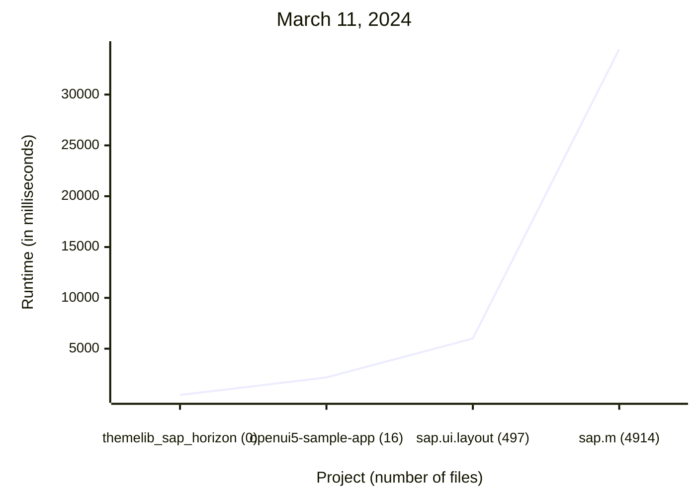

# Benchmark Projects

For all benchmarks below, execute `ui5lint` without any parameters. Benchmarks created based on [Benchmarking UI5 Tooling](https://sap.github.io/ui5-tooling/stable/pages/Benchmarking/):

```sh
hyperfine --warmup 1 \
'node $(which ui5lint)' \
--export-markdown ./bench.md
```

**TODO:** Memory benchmarking

## Non-JS library, no findings: OpenUI5 `themelib_sap_horizon`

_Reference commit: [`0efb2cd`](https://github.com/SAP/openui5/tree/0efb2cd89a893b499f40c43c7534240524c5de42/src/themelib_sap_horizon) (tag `1.120.10`)_

**Metadata:**

* Resources to lint: `0`
* Result: `0 problems (0 errors, 0 warnings)`

## Small app: `openui5-sample-app`

_Reference commit: [`fa6d40d`](https://github.com/SAP/openui5-sample-app/tree/fa6d40d2a3ef7c7bb7c416117a0efc675ec90c65)_

**Metadata:**

* Resources to lint: `16`
* Result: `6 problems (6 errors, 0 warnings)`

## Medium library: OpenUI5 `sap.ui.layout`

_Reference commit: [`0efb2cd`](https://github.com/SAP/openui5/tree/0efb2cd89a893b499f40c43c7534240524c5de42/src/sap.ui.layout) (tag `1.120.10`)_

**Metadata:**

* Resources to lint: `497`
* Result: `1308 problems (1308 errors, 0 warnings)`

## Large library: OpenUI5 `sap.m`

_Reference commit: [`0efb2cd`](https://github.com/SAP/openui5/tree/0efb2cd89a893b499f40c43c7534240524c5de42/src/sap.m) (tag `1.120.10`)_

**Metadata:**

* Resources to lint: `4914`
* Result: `11937 problems (11937 errors, 0 warnings)`
* This is around 10x more than sap.ui.layout

# Benchmark Runs

## March 11, 2024

* UI5 linter [`5466be5`](https://github.com/SAP/ui5-linter/commit/5466be5b983c4c6e6108c0d97d5221b8ad320a88)
* Node.js `v20.11.1`
* MacBook Pro M1 Max



### themelib_sap_horizon

| Mean [ms] | Min [ms] | Max [ms] |
|---:|---:|---:|
| 442.6 ± 33.8 | 409.4 | 529.5 |

### openui5-sample-app

Mean [s] | Min [s] | Max [s] |
|---:|---:|---:|
2.171 ± 0.072 | 2.076 | 2.315 |

### sap.ui.layout

| Mean [s] | Min [s] | Max [s] |
|---:|---:|---:|
6.002 ± 0.064 | 5.936 | 6.127 |

### sap.m

| Mean [s] | Min [s] | Max [s] |
|---:|---:|---:|
| 34.470 ± 0.421 | 34.178 | 35.585 |
